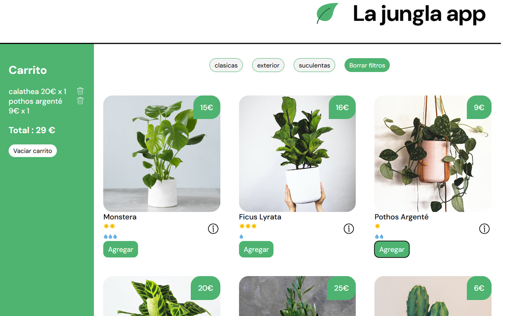

# 🌿 React Plant Shop

Una pequeña aplicación de tienda de plantas construida con **React**. Permite a los usuarios ver una lista de plantas, agregar productos a un carrito, visualizar información sobre cuidados de luz y agua, y mostrar modales informativos.

---

## 📸 Vista previa

---

## 🚀 Funcionalidades

- 🛒 Agregar y eliminar plantas del carrito
- 💧☀️ Visualizar cuidados de agua y luz con íconos interactivos
- 📦 Modal informativo sobre cada planta
- 🧠 Datos almacenados en `localStorage` para persistencia
- 💻 Estilos personalizados con CSS

---

## 🛠️ Tecnologías

- React + Vite
- CSS puro
- HTML5
- React Hooks (`useState`, `useEffect`)
- Icons & assets locales (`.svg`)

---

## 📦 Instalación

1. Clona el repositorio:

git clone https://github.com/tu-usuario/nombre-del-repo.git
cd nombre-del-repo

2. Instala las dependencias:

npm install

2. Inicia la app

npm run dev   # Si usas Vite

🙌 Autor
Betsabé Meneses

